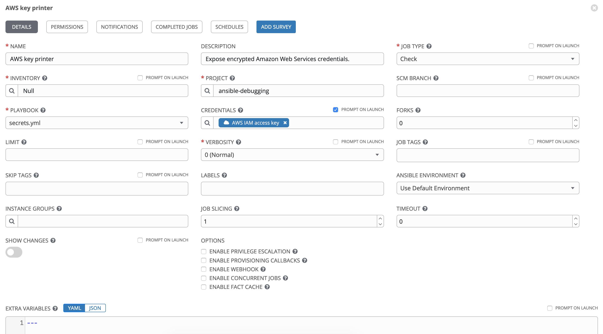
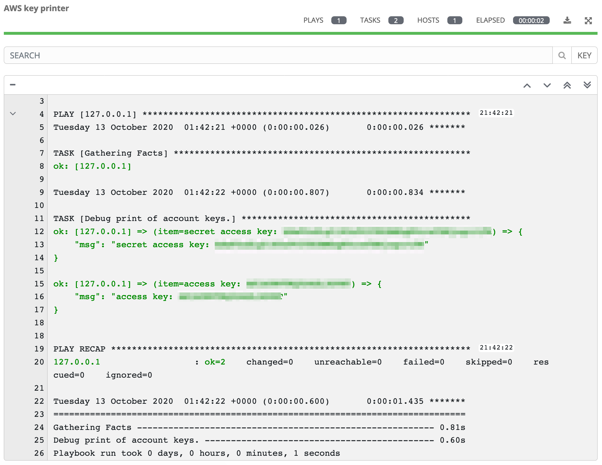

Expose Ansible Tower AWS Keys
=============================

Amazon Web Services CLI access keys are encrypted at rest in Ansible Tower, but they need to be loaded at runtime to authenticate using boto to AWS. That gives you an opportunity to print the keys to your console if you need a reminder of what they are.

